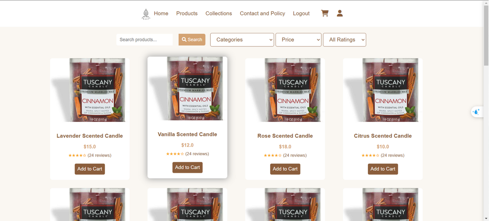
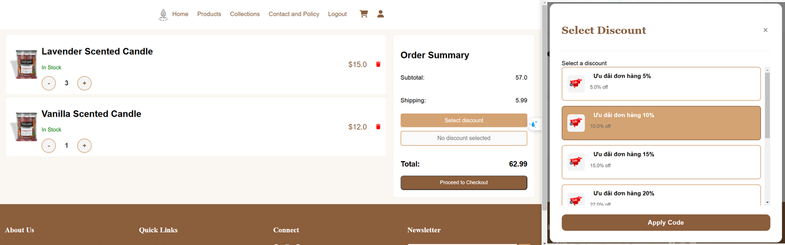

# Website Bán Nến Thơm
Website thương mại điện tử hỗ trợ mua sắm nến thơm trực tuyến với giao diện thân thiện và tính năng quản lý đơn hàng tiện lợi cho cả khách hàng và quản trị viên.

## 🚀 Chức năng chính
**Người dùng (User)**
- Đăng ký, đăng nhập, quản lý thông tin cá nhân.
- Tìm kiếm, lọc sản phẩm theo thương hiệu, giá, đánh giá.
- Quản lý giỏ hàng, áp dụng ưu đãi và thanh toán (PayPal, Momo, VNPAY…).
- Xem lịch sử đơn hàng và quản lý địa chỉ giao hàng.

**Quản lý (Manager)**
- Quản lý sản phẩm, loại sản phẩm, ưu đãi, đơn hàng, khách hàng.
- Thêm, sửa, xóa và cập nhật thông tin sản phẩm.

## 🛠 Công nghệ sử dụng
- **Ngôn ngữ lập trình:** Java
- **Backend:** Servlet, JSP, JSTL, JDBC
- **Frontend:** HTML, CSS, Bootstrap 5.3
- **Cơ sở dữ liệu:** SQL Server
- **Khác:** Toast notifications

## 📷 Demo giao diện




*(Thay link ảnh trên bằng ảnh chụp màn hình thực tế của bạn)*

## 📥 Cài đặt & chạy dự án
1. Clone repo:
   ```bash
   git clone https://github.com/<your-username>/<repo-name>.git
   ```
2. Import vào Eclipse.
3. Cấu hình kết nối cơ sở dữ liệu trong file config JDBC.
4. Chạy dự án trên Apache Tomcat 10.

## 📄 Báo cáo chi tiết
[Xem báo cáo đầy đủ tại đây](docs/BaoCaoDuAn.pdf)
